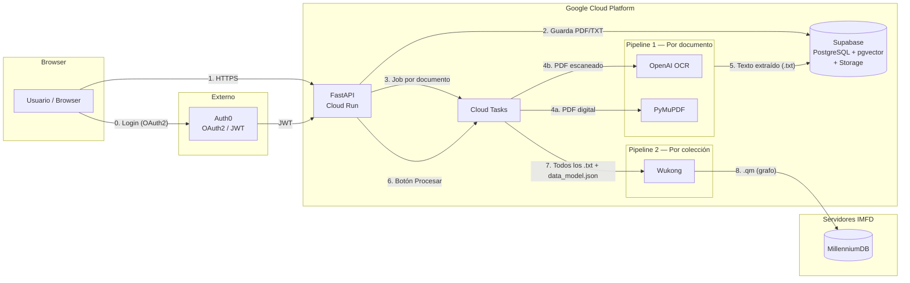
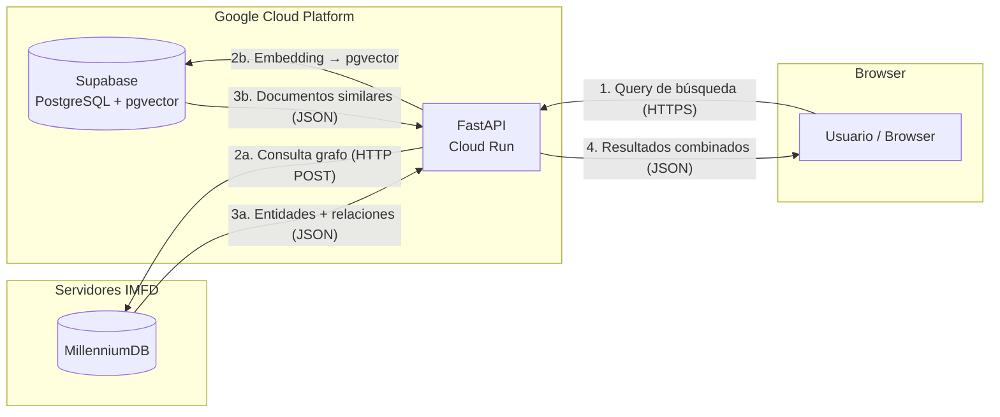

# Plataforma de Exploración Documental para Humanidades Digitales

> Proyecto de Título — Ingeniería Civil Industrial · Diploma en Tecnologías de Información
> Pontificia Universidad Católica de Chile · En colaboración con el **Instituto Milenio Fundamento de los Datos (IMFD)**

---

## Tabla de Contenidos

1. [Descripción General](#descripción-general)
2. [Cómo Funciona la Plataforma](#cómo-funciona-la-plataforma)
3. [Arquitectura del Sistema](#arquitectura-del-sistema)
4. [Stack Tecnológico](#stack-tecnológico)
5. [Estructura del Proyecto](#estructura-del-proyecto)
6. [Requisitos Previos](#requisitos-previos)
7. [Setup — Desarrollo Local](#setup--desarrollo-local)
8. [Variables de Entorno](#variables-de-entorno)
9. [CI/CD](#cicd)
10. [Testing](#testing)
11. [Integración con Wukong](#integración-con-wukong)
12. [Integración con MillenniumDB](#integración-con-millenniumdb)
13. [Docker](#docker)
14. [Equipo](#equipo)

---

## Descripción General

Plataforma web tipo **buscador** (no un chat) que permite a investigadores del IMFD:

1. Subir colecciones de documentos (PDF/TXT)
2. Definir qué entidades y relaciones quieren extraer (formulario → data model)
3. Procesar la colección con Wukong para construir un grafo de conocimiento
4. **Buscar** entidades, relaciones y documentos dentro del grafo generado

### Funcionalidades principales

| Funcionalidad | Descripción |
|---|---|
| **Carga de documentos** | PDFs (digitales y escaneados) y archivos TXT, organizados en colecciones |
| **Extracción de texto (Pipeline 1)** | PyMuPDF para PDFs digitales, OpenAI para OCR de escaneados. Se ejecuta automáticamente al subir cada documento |
| **Definición del data model** | El investigador define qué entidades y relaciones buscar mediante un formulario. Esto genera el `data_model.json` que Wukong necesita |
| **Construcción de grafo (Pipeline 2)** | El usuario presiona "Procesar colección" → Wukong toma **todos** los `.txt` de la colección + el `data_model.json` y genera el grafo (`.qm`) → se carga en MillenniumDB |
| **Búsqueda en el grafo** | Buscador tipo Google: el usuario escribe una query → FastAPI consulta MillenniumDB (grafo) y Supabase (búsqueda semántica con pgvector) → resultados combinados |
| **Visualización de grafo** | Cytoscape.js para explorar nodos y aristas interactivamente |

---

## Cómo Funciona la Plataforma

### Fase 1 — Carga de documentos

```
Investigador sube PDFs a una colección
        │
        ▼
Pipeline 1 (automático, por documento):
  ├── PDF digital   → PyMuPDF    → texto (.txt)
  └── PDF escaneado → OpenAI OCR → texto (.txt)
        │
        ▼
Textos guardados en Supabase Storage
```

### Fase 2 — Definición del data model

El investigador llena un formulario en el frontend indicando qué quiere extraer. Por ejemplo:

- **Contexto**: "Sentencias civiles de la Corte Suprema de Chile"
- **Entidades**: Sentencia (con rol, fecha, problema legal), Persona (con nombre)
- **Relaciones**: VotaEn (Persona → Sentencia, con decisión: "A Favor" / "En Contra")

Esto genera un `data_model.json` que Wukong usa para saber exactamente qué extraer.

### Fase 3 — Procesamiento con Wukong

```
Investigador presiona "Procesar colección"
        │
        ▼
Se arma el directorio que Wukong espera:
  data-dir/
  ├── docs/text/nombre-coleccion/
  │   ├── documento_1.txt
  │   ├── documento_2.txt
  │   └── ...
  └── data_model.json    ← generado del formulario
        │
        ▼
Wukong procesa (usa OpenAI internamente):
  1. Divide cada .txt en chunks
  2. Extrae entidades con el LLM
  3. Extrae relaciones con el LLM
  4. Exporta el grafo en formato .qm
        │
        ▼
Se carga el .qm en MillenniumDB:
  mdb import knowledge_graph.qm /path/to/db
  mdb server /path/to/db --port 1234
```

### Fase 4 — Búsqueda (el producto principal)

```
Investigador escribe en el buscador: "Pérez González"
        │
        ▼
FastAPI recibe la query y ejecuta en paralelo:
  ├── Consulta a MillenniumDB → entidades, relaciones del grafo
  └── Búsqueda semántica (pgvector/Supabase) → fragmentos de texto relevantes
        │
        ▼
Frontend muestra resultados:
  ├── Grafo interactivo (Cytoscape.js)
  ├── Lista de entidades encontradas
  ├── Documentos/fragmentos relacionados
  └── Filtros por tipo, colección, fecha
```

---

## Arquitectura del Sistema

### Diagrama A — Flujo de carga y procesamiento (ida)

Cuando el usuario sube documentos y los procesa:



### Diagrama B — Flujo de consulta/búsqueda (vuelta)

Cuando el usuario busca en el buscador:



### Protocolos de comunicación

| Conexión | Protocolo | Detalle |
|---|---|---|
| Browser ↔ FastAPI | **HTTPS** | Requests REST. Frontend hace `fetch()` a la API |
| Browser → Auth0 | **HTTPS (OAuth2)** | Redirect al login de Auth0, devuelve JWT |
| FastAPI → Auth0 | **HTTPS (JWKS)** | Descarga las public keys de Auth0 para validar tokens JWT |
| FastAPI → Supabase | **HTTPS (REST API)** | Cliente de Supabase con anon key para DB + Storage |
| FastAPI → MillenniumDB | **HTTP POST** | Query al endpoint `/sparql` del servidor `mdb`. Respuesta en JSON/CSV |
| FastAPI → OpenAI | **HTTPS (REST API)** | Llamadas a la API de OpenAI para OCR y embeddings |
| FastAPI → Cloud Tasks | **gRPC (GCP SDK)** | Crea tasks en la cola de GCP |
| FastAPI ↔ Wukong | **Python (local)** | Wukong es un paquete Python instalado en el backend. Se llama directo |
| Wukong → OpenAI | **HTTPS (REST API)** | Wukong usa OpenAI internamente para extraer entidades/relaciones |

### Notas clave

- **FastAPI sirve todo**: la API REST y el frontend estático compilado (React/Vite). No hay Firebase ni hosting separado.
- **Auth0** es externo a GCP. Maneja login (OAuth2) y emite tokens JWT que FastAPI valida.
- **MillenniumDB** corre en servidores del IMFD (fuera de GCP). FastAPI le hace requests HTTP POST al puerto 1234.
- **Wukong** se instala como paquete Python dentro del backend (submodule o carpeta local). No es un servicio HTTP externo.
- **Cloud Tasks** maneja los jobs de procesamiento de forma asíncrona dentro de GCP.
- **Archivos `.txt`** subidos directamente se guardan en Supabase sin pasar por Pipeline 1 (ya son texto plano).

---

## Stack Tecnológico

| Capa | Tecnología | Versión |
|---|---|---|
| Frontend | React + TypeScript + Vite | React 19, Vite 8, Node 20 |
| Backend / API | FastAPI (Python) en Cloud Run | Python 3.13, FastAPI 0.115 |
| Autenticación | Auth0 (JWT / OAuth2) | Servicio externo |
| Base de datos + Storage | Supabase (PostgreSQL + pgvector + Storage) | — |
| Extracción de texto | PyMuPDF + OpenAI (OCR) | — |
| Grafo de conocimiento | Wukong (IMFD) → MillenniumDB (IMFD) | Python 3.13 |
| Embeddings + Búsqueda | OpenAI API (text-embedding-3-small) + pgvector | — |
| Cola de tareas | Cloud Tasks (GCP) | — |
| Visualización de grafo | Cytoscape.js (react-cytoscapejs) | — |
| CI/CD | GitHub Actions → Cloud Run | — |

> **Nota sobre Python**: Wukong requiere Python 3.13+. El backend usa la misma versión para compatibilidad.

---

## Estructura del Proyecto

```
TallerDeIntegracion_G10/
├── .github/
│   └── workflows/
│       └── ci.yml              # Pipeline CI: lint + test en cada push/PR a main
├── backend/
│   ├── app/
│   │   ├── __init__.py         # Marca app/ como paquete Python
│   │   ├── main.py             # Punto de entrada FastAPI: CORS, rutas, hosting estático
│   │   ├── config.py           # Variables de entorno tipadas con Pydantic Settings
│   │   ├── api/
│   │   │   ├── __init__.py
│   │   │   └── routes/
│   │   │       ├── __init__.py
│   │   │       └── health.py   # GET /health y GET /ready (Cloud Run health checks)
│   │   ├── models/             # Schemas Pydantic para requests/responses (por crear)
│   │   │   └── __init__.py
│   │   ├── services/           # Lógica de negocio: Wukong, OpenAI, MDB (por crear)
│   │   │   └── __init__.py
│   │   └── middleware/         # Autenticación JWT con Auth0 (por crear)
│   │       └── __init__.py
│   ├── wukong-engine/          # Submodule de Wukong (se agrega con git submodule)
│   ├── tests/
│   │   ├── __init__.py
│   │   └── test_health.py      # Tests de los endpoints /health y /ready
│   ├── requirements.txt        # Dependencias Python (incluye ./wukong-engine)
│   ├── Dockerfile              # Imagen Docker del backend para Cloud Run
│   └── .env.example            # Plantilla de variables de entorno
├── frontend/
│   ├── src/
│   │   ├── main.tsx            # Punto de entrada: monta React en el DOM
│   │   ├── App.tsx             # Componente raíz
│   │   ├── App.css             # Estilos del componente App
│   │   ├── index.css           # Estilos globales
│   │   └── assets/             # Imágenes y recursos estáticos
│   ├── public/                 # Archivos servidos directamente (favicon)
│   ├── index.html              # HTML base donde se monta React
│   ├── package.json            # Dependencias y scripts npm
│   ├── package-lock.json       # Lockfile de npm
│   ├── tsconfig.json           # Config base de TypeScript
│   ├── tsconfig.app.json       # Config TS para código de la app
│   ├── tsconfig.node.json      # Config TS para archivos de config (vite.config.ts)
│   ├── vite.config.ts          # Configuración de Vite (bundler y dev server)
│   ├── eslint.config.js        # ESLint con integración Prettier
│   ├── .prettierrc             # Formato: sin punto y coma, comillas simples, 2 espacios
│   └── .gitignore              # Ignora node_modules/ y dist/
├── Dockerfile                  # Build completo (frontend + backend) para Cloud Run
├── docker-compose.yml          # Desarrollo local con Docker
├── .gitignore                  # Exclusiones globales del repo
└── README.md                   # Este archivo
```

### Qué hace cada archivo clave

| Archivo | Qué hace |
|---|---|
| `backend/app/main.py` | Crea la app FastAPI, configura CORS, registra rutas. En producción, sirve el frontend compilado como archivos estáticos (SPA catch-all) |
| `backend/app/config.py` | Lee las variables de entorno del `.env` y las expone como un objeto tipado. Si falta una variable obligatoria, la app falla al arrancar con error claro |
| `backend/app/api/routes/health.py` | Dos endpoints que Cloud Run usa para saber si el contenedor está vivo (`/health`) y listo para tráfico (`/ready`) |
| `backend/requirements.txt` | Dependencias Python con versiones exactas. Incluye `./wukong-engine` para instalar Wukong como paquete local |
| `backend/.env.example` | Plantilla con todas las variables de entorno necesarias. Cada dev la copia como `.env` y pone sus credenciales reales |
| `backend/Dockerfile` | Imagen Docker multi-stage del backend. Instala dependencias, copia código y sirve en puerto 8080 |
| `Dockerfile` (raíz) | Build completo: compila el frontend (Node 20) + backend (Python 3.13) en una sola imagen para Cloud Run |
| `docker-compose.yml` | Levanta el backend en local con hot reload. Monta el código y el build del frontend |
| `.github/workflows/ci.yml` | Pipeline CI que corre en cada push/PR a main: linter + tests del backend, linter + build del frontend |

---

## Requisitos Previos

| Herramienta | Versión mínima | Para qué |
|---|---|---|
| **Python** | 3.13+ | Backend + Wukong (ambos requieren 3.13) |
| **Node.js** | 20+ | Frontend (React + Vite) |
| **npm** | 10+ | Gestor de paquetes del frontend |
| **Git** | 2.x | Control de versiones |
| **Docker** | 24+ | (Opcional) Desarrollo local con contenedores |

> **Tip**: Para manejar múltiples versiones de Python, se recomienda usar [pyenv](https://github.com/pyenv/pyenv).

---

## Setup — Desarrollo Local

### 1. Clonar el repositorio

```bash
git clone https://github.com/your-org/TallerDeIntegracion_G10.git
cd TallerDeIntegracion_G10
```

Si el repo usa Wukong como submodule:

```bash
git submodule update --init --recursive
```

### 2. Backend

```bash
cd backend

# Crear y activar entorno virtual con Python 3.13
python3.13 -m venv .venv
source .venv/bin/activate        # En Windows: .venv\Scripts\activate

# Instalar dependencias (incluye Wukong)
pip install -r requirements.txt

# Configurar variables de entorno
cp .env.example .env
# Abrir .env y llenar con tus credenciales (ver sección Variables de Entorno)

# Levantar el servidor de desarrollo
uvicorn app.main:app --reload --port 8080
```

El backend queda disponible en:
- API: `http://localhost:8080`
- Docs interactivos (Swagger): `http://localhost:8080/docs`
- Docs alternativo (ReDoc): `http://localhost:8080/redoc`

### 3. Frontend

```bash
cd frontend

# Instalar dependencias
npm install

# Levantar el servidor de desarrollo
npm run dev
```

El frontend queda disponible en `http://localhost:5173`.

### 4. Verificar que todo funciona

```bash
# Desde la raíz del proyecto:

# Backend — tests
cd backend && source .venv/bin/activate && pytest tests/ -v

# Backend — linter
ruff check app/ tests/

# Frontend — linter + build
cd ../frontend && npm run lint && npm run format:check && npm run build
```

---

## Variables de Entorno

El backend necesita un archivo `.env` dentro de `backend/`. Copia la plantilla y llena tus credenciales:

```bash
cd backend
cp .env.example .env
```

### Referencia completa

```env
# ──────────────────────────────────────────────
# OpenAI — REQUERIDO
# Se usa para: OCR de PDFs escaneados, embeddings de búsqueda semántica,
# y Wukong lo usa internamente para extraer entidades/relaciones.
# Formato: pegar la key TAL CUAL, sin comillas.
# ──────────────────────────────────────────────
OPENAI_API_KEY=sk-proj-abc123...

# ──────────────────────────────────────────────
# Supabase — Base de datos + Storage
# ──────────────────────────────────────────────
SUPABASE_URL=https://your-project.supabase.co
SUPABASE_KEY=eyJhbGciOiJIUz...

# ──────────────────────────────────────────────
# Auth0 — Autenticación
# ──────────────────────────────────────────────
AUTH0_DOMAIN=your-tenant.auth0.com
AUTH0_API_AUDIENCE=https://your-api-identifier

# ──────────────────────────────────────────────
# MillenniumDB — Servidores del IMFD
# Host y puerto donde corre el servidor mdb
# ──────────────────────────────────────────────
MILLENNIUMDB_HOST=imfd-server.example.com
MILLENNIUMDB_PORT=1234

# ──────────────────────────────────────────────
# GCP Cloud Tasks — Pipeline asíncrono
# ──────────────────────────────────────────────
GCP_PROJECT_ID=your-gcp-project
CLOUD_TASKS_QUEUE=your-queue-name
CLOUD_TASKS_LOCATION=us-central1

# ──────────────────────────────────────────────
# App
# ──────────────────────────────────────────────
DEBUG=true
```

> **Importante sobre `OPENAI_API_KEY`**: Pegar la key directamente, **sin comillas**. Ejemplo correcto:
> ```
> OPENAI_API_KEY=sk-proj-abc123xyz456...
> ```
> Ejemplo incorrecto:
> ```
> OPENAI_API_KEY="sk-proj-abc123xyz456..."   # ← NO usar comillas
> ```

> **Importante**: El archivo `.env` **nunca** se sube al repositorio (está en el `.gitignore`). Cada desarrollador tiene el suyo.

---

## CI/CD

El archivo `.github/workflows/ci.yml` define un pipeline que se ejecuta automáticamente en cada **push** y **pull request** a `main`.

| Job | Qué hace |
|---|---|
| **Backend** | Instala Python 3.13, instala dependencias, corre `ruff check` (linter) y `pytest` (tests) |
| **Frontend** | Instala Node 20, instala dependencias, corre `eslint` (linter), `prettier --check` (formato) y `npm run build` (compilación TypeScript + Vite) |

Ambos jobs corren **en paralelo**. Si alguno falla, el PR queda bloqueado hasta que se corrija.

---

## Testing

### Backend

```bash
cd backend
source .venv/bin/activate
pytest tests/ -v
```

Tests actuales:
- `test_health_check` — verifica que `GET /health` devuelve `{"status": "healthy"}`
- `test_readiness_check` — verifica que `GET /ready` devuelve `{"status": "ready"}`

### Frontend

```bash
cd frontend
npm run lint            # Errores de código
npm run format:check    # Verifica formato (sin modificar archivos)
npm run build           # Compila TypeScript + Vite (detecta errores de tipos/imports)
```

---

## Integración con Wukong

[Wukong](https://github.com/MillenniumDB/wukong-engine) es el motor que construye grafos de conocimiento a partir de documentos de texto. Se instala como **paquete Python local** dentro del backend (no es un servicio externo).

### Cómo agregar Wukong al repo

**Opción A — Git submodule (recomendada)**:

```bash
cd backend
git submodule add https://github.com/MillenniumDB/wukong-engine.git wukong-engine
```

**Opción B — Clonar la carpeta directamente**:

```bash
cd backend
git clone https://github.com/MillenniumDB/wukong-engine.git wukong-engine
```

En ambos casos, `requirements.txt` ya incluye la línea `./wukong-engine` que le dice a pip que instale el paquete desde esa carpeta local.

### Qué necesita Wukong para correr

1. **`OPENAI_API_KEY`** — la misma variable de entorno que usa el backend.
2. **Un directorio de datos** con esta estructura:

```
data-dir/
├── docs/
│   └── text/
│       └── nombre-coleccion/
│           ├── documento_1.txt
│           ├── documento_2.txt
│           └── ...
└── data_model.json
```

3. **El `data_model.json`** — generado desde el formulario del frontend. Define:
   - `parameters`: contexto, rol del LLM, idioma
   - `entities`: tipos de entidades a extraer (con propiedades, primary key, descripción)
   - `relations`: tipos de relaciones entre entidades

### Cómo se ejecuta Wukong

```bash
# Desde el directorio de wukong-engine:
python -m wukong_engine <path/to/data_dir>

# Con configuración custom:
python -m wukong_engine <path/to/data_dir> --config <path/to/config.toml>
```

### Qué produce Wukong

El output se guarda en `<data_dir>/exports/` y contiene:
- **`knowledge_graph.qm`** — el archivo que se carga en MillenniumDB
- Archivos JSON y CSV con las entidades y relaciones extraídas

El grafo incluye entidades especiales `Document` y `Chunk`, y relaciones `ChunkOf` y `ExtractedFrom` para trazabilidad.

---

## Integración con MillenniumDB

[MillenniumDB](https://github.com/MillenniumDB/MillenniumDB) es la base de datos de grafos del IMFD. Corre en **servidores del IMFD** (fuera de GCP). El backend se comunica con ella vía HTTP.

### Comandos principales de MillenniumDB

```bash
# 1. Importar un archivo .qm para crear la base de datos
mdb import knowledge_graph.qm /path/to/mi-db

# 2. Levantar el servidor para recibir consultas HTTP
mdb server /path/to/mi-db --port 1234 --timeout 3600
```

### Cómo consultar MillenniumDB desde el backend

El servidor escucha en el puerto configurado (default `1234`) y acepta queries vía HTTP POST:

```bash
# Ejemplo: consultar desde la terminal
curl -H "Content-Type:application/sparql-query" \
     -H "Accept:text/csv" \
     --data-binary "@query.txt" \
     -X POST http://localhost:1234/sparql
```

Desde el backend (Python con httpx):

```python
import httpx

async def query_millennium(query: str) -> str:
    async with httpx.AsyncClient() as client:
        response = await client.post(
            f"http://{settings.millenniumdb_host}:{settings.millenniumdb_port}/sparql",
            content=query,
            headers={
                "Content-Type": "application/sparql-query",
                "Accept": "application/json",
            },
        )
        return response.json()
```

### Formato del archivo .qm (Quad Model)

```
# Nodos (entidades) — id :Label propiedad:"valor"
a0 :Persona nombre:"Juan Pérez" edad:45
s0 :Sentencia rol:"13500-2025" fecha:"T20250115"

# Aristas (relaciones) — origen->destino :Label propiedad:"valor"
a0->s0 :VotaEn decision:"A Favor"
```

---

## Docker

### Desarrollo local (solo backend)

```bash
docker compose up --build
```

Esto levanta el backend en `http://localhost:8080` con hot reload. Si quieres probar el hosting del frontend integrado:

```bash
# Primero compilar el frontend
cd frontend && npm run build && cd ..

# Luego levantar con Docker (monta frontend/dist como static/)
docker compose up --build
```

### Build de producción (imagen completa para Cloud Run)

```bash
# Desde la raíz del proyecto
docker build -t imfd-explorer:latest .
```

Esto crea una sola imagen que incluye el frontend compilado + el backend, lista para Cloud Run.

```bash
# Probar localmente
docker run -p 8080:8080 --env-file backend/.env imfd-explorer:latest
```

---

## Equipo

Proyecto de Título 2025 — Pontificia Universidad Católica de Chile
En colaboración con el Instituto Milenio Fundamento de los Datos (IMFD)
