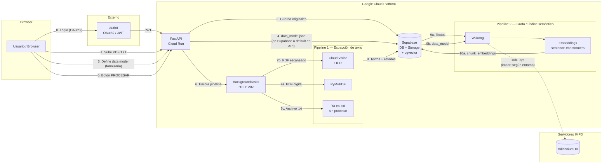
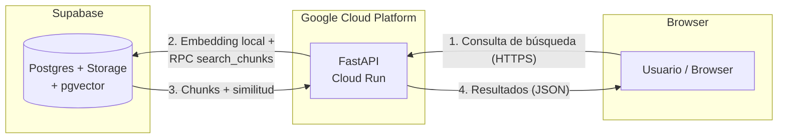

# Plataforma de Exploración Documental para Humanidades Digitales

> Proyecto de Título — Ingeniería Civil Industrial · Diploma en Tecnologías de Información
> Pontificia Universidad Católica de Chile · En colaboración con el **Instituto Milenio Fundamento de los Datos (IMFD)**

---

## Tabla de Contenidos

1. [Descripción General](#descripción-general)
2. [Cómo Funciona la Plataforma](#cómo-funciona-la-plataforma)
3. [Arquitectura del Sistema](#arquitectura-del-sistema)
4. [Stack Tecnológico](#stack-tecnológico)
5. [Estructura del Proyecto](#estructura-del-proyecto)
6. [Requisitos Previos](#requisitos-previos)
7. [Setup — Desarrollo Local](#setup--desarrollo-local)
8. [Variables de Entorno](#variables-de-entorno)
9. [CI/CD](#cicd)
10. [Testing](#testing)
11. [Integración con Wukong](#integración-con-wukong)
12. [Integración con MillenniumDB](#integración-con-millenniumdb)
13. [Docker](#docker)
14. [Equipo](#equipo)

---

## Descripción General

Plataforma web tipo **buscador** (no un chat) que permite a investigadores del IMFD:

1. Subir colecciones de documentos (PDF/TXT)
2. Definir qué entidades y relaciones quieren extraer (formulario → `data_model.json`; en paralelo el backend puede usar un modelo por defecto en desarrollo)
3. Procesar la colección con Wukong para construir un grafo de conocimiento (export `.qm`) y generar **embeddings de chunks** almacenados en **Supabase (pgvector)**
4. **Buscar** de forma **semántica** sobre fragmentos indexados (`POST /api/search`) cuando la colección está lista; el **grafo en MillenniumDB** queda como línea de evolución para consultas directas al grafo

### Funcionalidades principales

| Funcionalidad | Descripción |
|---|---|
| **Carga de documentos** | El usuario sube PDFs y/o TXTs a una colección. Se guardan en Supabase **Storage** con registro en la base |
| **Definición del data model** | Objetivo de producto: formulario en el frontend que produce el `data_model.json` que Wukong consume. Hoy el backend suele apoyarse en `app/services/default_data_model.json` mientras esa persistencia por colección evoluciona |
| **Procesamiento (“Generar Grafo”)** | `POST /api/collections/{id}/process` devuelve **202 Accepted** y delega en **FastAPI BackgroundTasks** (`wukong_runner.process_collection`). El frontend debe **consultar de forma periódica (polling)** `GET /api/collections/{id}` y revisar `processing_status` / `processing_error_message`. Flujo: extracción (TXT / PyMuPDF / **Google Cloud Vision** en PDFs escaneados) → Wukong → escritura de **`chunk_embeddings`** en Supabase. La **carga automática del `.qm` en MillenniumDB** es **pendiente de integrar** en el código (p. ej. PDT10-121); en muchos entornos el import sigue siendo operación en el servidor IMFD |
| **Búsqueda** | **`POST /api/search`**: misma familia de modelos que en indexación (**sentence-transformers**, `paraphrase-multilingual-MiniLM-L12-v2`) + RPC SQL **`search_chunks`** sobre `chunk_embeddings`. La colección debe estar en `graph_ready` o `partial_error` |
| **Visualización** | UI en React: landing, login Auth0, flujo de colección, **buscador por colección**, modales de carga y documentos (no hay Cytoscape en el frontend actual) |

---

## Cómo Funciona la Plataforma

### Fase 1 — Carga de documentos

```
Investigador sube archivos (PDF y/o TXT) a una colección
        │
        ▼
Se guardan TAL CUAL en Supabase (Storage) y se registran en la base
No corre el pipeline hasta usar “Generar Grafo” / POST .../process.
```

### Fase 2 — Definición del data model

El investigador llena un formulario en el frontend indicando qué quiere extraer. Por ejemplo:

- **Contexto**: "Sentencias civiles de la Corte Suprema de Chile"
- **Entidades**: Sentencia (con rol, fecha, problema legal), Persona (con nombre)
- **Relaciones**: VotaEn (Persona → Sentencia, con decisión: "A Favor" / "En Contra")

Esto genera un `data_model.json` que Wukong usa para saber exactamente qué extraer.

> **Implementación actual:** el workdir que arma el backend incluye un `data_model.json` (por defecto copiado desde `app/services/default_data_model.json`, alineado con el conjunto `preview` en Wukong). Cuando el formulario persista un modelo por colección, reemplazará ese archivo en el flujo.

### Fase 3 — Procesamiento (botón “Generar Grafo” / `POST .../process`)

El usuario dispara el procesamiento. La API responde **de inmediato con HTTP 202** y el trabajo sigue en **segundo plano**; no hay que bloquear la UI esperando el fin del pipeline.

```
POST /api/collections/{id}/process   →   202 Accepted
        │   (BackgroundTasks → wukong_runner.process_collection)
        ▼
═══════════════════════════════════════════════════════
  PIPELINE 1 — Extracción de texto (por documento)
═══════════════════════════════════════════════════════

  El backend descarga los archivos originales de Supabase
        │
        ▼
  Para cada archivo:
  ├── Es .txt?          → lectura directa del texto
  ├── PDF digital?      → PyMuPDF extrae el texto
  └── PDF escaneado?    → Google Cloud Vision (OCR por página renderizada)
        │
        ▼
  El texto extraído se guarda en Supabase (tabla de textos / estados por documento)

        │
        ▼
═══════════════════════════════════════════════════════
  CARPETA TEMPORAL — Workdir Wukong (p. ej. bajo /tmp/)
═══════════════════════════════════════════════════════

  Estructura que espera Wukong (simplificado):

  .../docs/text/preview/
  │     ├── <id-doc>.txt
  │     └── ...
  └── data_model.json

  Opcional en desarrollo: si defines `WUKONG_ARTIFACTS_DIR`, se conserva una copia del workdir.

        │
        ▼
═══════════════════════════════════════════════════════
  PIPELINE 2 — Wukong procesa el workdir
═══════════════════════════════════════════════════════

  El backend ejecuta (subprocess), por ejemplo:
    python -m wukong_engine <workdir> --config backend/wukong-engine/config/default.toml

  Wukong lee los .txt + data_model.json y:
    1. Divide cada .txt en chunks
    2. Usa OpenAI para extraer entidades y relaciones
    3. Emite artefactos bajo exports/ (incl. .qm y JSON de Document / Chunk / …)

        │
        ▼
═══════════════════════════════════════════════════════
  PIPELINE 3 — Índice semántico en Supabase (pgvector)
═══════════════════════════════════════════════════════

  Con los artefactos de chunks, el backend genera embeddings locales
  (sentence-transformers) y los inserta en la tabla chunk_embeddings
  (índice HNSW + RPC search_chunks).

        │
        ▼
═══════════════════════════════════════════════════════
  MillenniumDB (evolución / operación IMFD)
═══════════════════════════════════════════════════════

  El .qm puede importarse en el servidor IMFD (mdb import …). Ese paso
  puede ser manual u orquestado según el despliegue; el código actual
  documenta la integración como trabajo pendiente.

  La carpeta temporal se elimina al terminar (salvo copia vía WUKONG_ARTIFACTS_DIR).
```

> **Resumen**:
> - Originales y textos extraídos quedan en **Supabase**
> - Chunks + embeddings para búsqueda quedan en **Supabase (`chunk_embeddings`)**
> - El **grafo lógico** (.qm / MillenniumDB) depende de la operación IMFD y de la integración pendiente
> - Estados de colección incluyen: `idle`, `processing_text`, `processing_graph`, `graph_ready`, `partial_error`, `error`

### Fase 4 — Búsqueda (producto actual)

```
Investigador escribe en el buscador de la colección
        │
        ▼
POST /api/search  { coleccion_id, query, filtros opcionales, … }
        │
        ▼
FastAPI genera el embedding de la consulta (mismo modelo que en indexación)
        │
        ▼
Supabase: RPC search_chunks (similitud coseno; filtros por tipo / años si aplica)
        │
        ▼
FastAPI devuelve fragmentos, score y enlace firmado al PDF cuando corresponde
        │
        ▼
Frontend muestra lista de resultados relevantes a la colección
```

---

## Arquitectura del Sistema

### Diagrama A — Flujo de carga y procesamiento

Misma forma que en la rama **main** (pasos numerados 0–10, mismos bloques Browser / Auth0 / GCP / IMFD). Actualización respecto a `main`: **BackgroundTasks** en lugar de Cloud Tasks, **Cloud Vision** en lugar de OpenAI para OCR, **Pipeline 2** incluye embeddings y **10a/10b** separan índice en Supabase del export **.qm** hacia IMFD.



### Diagrama B — Flujo de consulta / búsqueda

Misma composición que en **main**: `graph RL`, tres bloques (navegador, **Google Cloud Platform** con solo FastAPI, y un bloque de **servidor de datos** — en `main` era IMFD/MillenniumDB; aquí **Supabase** cumple ese rol para la búsqueda productiva). Cuatro pasos numerados 1–4 como en el original.



> Consultas interactivas directas al grafo en **MillenniumDB** (WebSocket) son un flujo aparte, no el que ejecuta hoy `POST /api/search`.

### Protocolos de comunicación

| Conexión | Protocolo | Detalle |
|---|---|---|
| Browser ↔ FastAPI | **HTTPS** (producción) / **HTTP** (local) | REST; CORS permite el origen del dev server de Vite |
| Browser → Auth0 | **HTTPS (OAuth2)** | Login; el front obtiene JWT para la API |
| FastAPI → Auth0 | **HTTPS (JWKS)** | Validación de JWT (middleware) |
| FastAPI → Supabase | **HTTPS (REST)** | Cliente PostgREST / Storage / RPC (`search_chunks`, etc.) |
| FastAPI → Google Cloud Vision | **API cliente oficial** | Credenciales vía `GOOGLE_APPLICATION_CREDENTIALS` |
| FastAPI → MillenniumDB | **WebSocket** | Driver `millenniumdb_driver` (`ws://host:puerto`) cuando se use desde el backend |
| FastAPI → OpenAI | **HTTPS** | **Wukong** (entidades/relaciones); no reemplaza el OCR escaneado, que es Vision |
| Embeddings | **Proceso local** | `sentence-transformers` (sin API key; descarga modelo a caché) |
| FastAPI ↔ Wukong | **Subproceso Python** | `python -m wukong_engine` en el mismo contenedor / máquina |
| Cloud Tasks | **(Reservado)** | Variables en `config.py`; el flujo **implementado** hoy usa **BackgroundTasks**, no Cloud Tasks |

### Notas clave

- **FastAPI sirve**: la API REST y, si existe el build, el frontend estático bajo `backend/static/` (catch-all SPA).
- **Auth0** es externo. JWT validados en rutas protegidas.
- **Búsqueda entregada al usuario** hoy es **vectorial sobre chunks en Supabase**, no una consulta obligatoria a MillenniumDB por cada búsqueda.
- **Wukong** es submódulo en `backend/wukong-engine/`; hay que instalarlo con pip **editable** (ver setup).
- **Archivos .txt** subidos se procesan igual que otros: se normalizan a texto en Pipeline 1 (lectura directa), no se “saltan” el pipeline de extracción en el sentido de omitir el paso de registro de texto.

---

## Stack Tecnológico

| Capa | Tecnología | Versión |
|---|---|---|
| Frontend | React + TypeScript + Vite | React 19, Vite 8, Node 20 |
| Backend / API | FastAPI (Python), despliegue típico Cloud Run | Python 3.13, FastAPI 0.115 |
| Autenticación | Auth0 (JWT / OAuth2) | Servicio externo |
| Base de datos + Storage + vectores | Supabase (Postgres, Storage, **pgvector**) | — |
| Extracción de texto | PyMuPDF + **Google Cloud Vision** (OCR escaneados) | `google-cloud-vision` |
| Grafo de conocimiento | Wukong (IMFD) → export `.qm` | Python 3.13 |
| Búsqueda semántica | **sentence-transformers** + Supabase `search_chunks` | `paraphrase-multilingual-MiniLM-L12-v2` |
| Grafo en IMFD | MillenniumDB + driver WebSocket | — |
| Orquestación async (actual) | FastAPI **BackgroundTasks** | — |
| Cola (planeada / env) | Cloud Tasks (GCP) | Variables preparadas en config |
| CI/CD | GitHub Actions → Cloud Run | — |

> **Nota sobre Python**: Wukong requiere Python 3.13+. El backend usa la misma versión para compatibilidad.

---

## Estructura del Proyecto

```
TallerDeIntegracion_G10/
├── .github/
│   └── workflows/
│       └── ci.yml              # Pipeline CI: lint + test en cada push/PR a main
├── backend/
│   ├── app/
│   │   ├── __init__.py
│   │   ├── main.py             # FastAPI: CORS, routers, static SPA si existe
│   │   ├── config.py           # Pydantic Settings
│   │   ├── api/
│   │   │   ├── __init__.py
│   │   │   └── routes/
│   │   │       ├── __init__.py
│   │   │       ├── health.py        # GET /health, GET /ready
│   │   │       ├── collections.py   # CRUD colecciones + POST .../process (202)
│   │   │       ├── documentos.py   # Carga y gestión de documentos
│   │   │       ├── usuarios.py     # Perfil / cuenta (prefijo /usuarios)
│   │   │       └── search.py       # POST /api/search
│   │   ├── middleware/
│   │   │   └── auth.py             # JWT Auth0
│   │   ├── models/                 # Pydantic (documentos, búsqueda, …)
│   │   └── services/
│   │       ├── supabase_client.py  # DB, Storage, chunk_embeddings, RPC búsqueda
│   │       ├── text_extraction.py  # TXT / PyMuPDF / Vision
│   │       ├── wukong_runner.py    # Orquestación post “Generar Grafo”
│   │       ├── embeddings_service.py
│   │       ├── millenniumdb.py     # Cliente WebSocket (consultas grafo)
│   │       └── default_data_model.json
│   ├── supabase/
│   │   └── migrations/
│   │       ├── 001_initial_schema.sql
│   │       ├── 002_storage_bucket.sql
│   │       ├── 003_collection_processing_status.sql
│   │       ├── 003_collections_processing.sql
│   │       ├── 003_document_sha256_hash.sql
│   │       └── 004_chunk_embeddings.sql
│   ├── wukong-engine/          # Submodule Wukong
│   ├── tests/
│   │   ├── __init__.py
│   │   ├── test_health.py
│   │   ├── test_documentos.py
│   │   ├── test_text_extraction.py
│   │   └── test_wukong_runner.py
│   ├── requirements.txt
│   ├── Dockerfile
│   └── .env.example
├── frontend/
│   ├── src/
│   │   ├── main.tsx
│   │   ├── App.tsx
│   │   ├── App.css
│   │   ├── index.css
│   │   ├── pages/              # landing, login, buscador_coleccion, navbar, …
│   │   ├── components/         # modales (carga, documentos, eliminar, …)
│   │   └── assets/
│   ├── public/
│   ├── index.html
│   ├── package.json
│   ├── package-lock.json
│   ├── tsconfig*.json
│   ├── vite.config.ts
│   ├── eslint.config.js
│   ├── .prettierrc
│   └── .gitignore
├── Dockerfile
├── docker-compose.yml
├── .gitignore
└── README.md                   # Este archivo
```

### Qué hace cada archivo clave

| Archivo | Qué hace |
|---|---|
| `backend/app/main.py` | App FastAPI, CORS, inclusión de rutas, montaje estático `/assets` y SPA si `backend/static/` existe |
| `backend/app/config.py` | Variables de entorno tipadas |
| `backend/app/api/routes/collections.py` | Colecciones + **`POST /{id}/process`** (202, BackgroundTasks) |
| `backend/app/api/routes/search.py` | **`POST /api/search`** (embeddings + Supabase) |
| `backend/app/services/wukong_runner.py` | Pipeline extracción → Wukong → embeddings → estados de colección |
| `backend/supabase/migrations/004_chunk_embeddings.sql` | Tabla vectorial + función `search_chunks` |
| `backend/requirements.txt` | Dependencias Python (no incluye el submódulo Wukong; instalar aparte con `-e`) |
| `backend/.env.example` | Plantilla de variables (Vision, Supabase service role, Auth0 M2M, etc.) |
| `backend/Dockerfile` | Imagen del backend |
| `Dockerfile` (raíz) | Build frontend + backend para Cloud Run |
| `docker-compose.yml` | Dev local con hot reload |
| `.github/workflows/ci.yml` | CI backend (ruff, pytest) + frontend (eslint, prettier, build) |

---

## Requisitos Previos

| Herramienta | Versión mínima | Para qué |
|---|---|---|
| **Python** | 3.13+ | Backend + Wukong |
| **Node.js** | 20+ | Frontend |
| **npm** | 10+ | Frontend |
| **Git** | 2.x | Submódulo `wukong-engine` |
| **Docker** | 24+ | (Opcional) Desarrollo con contenedores |
| **Cuenta / clave GCP** | — | Solo si pruebas el OCR con **Cloud Vision** |

> **Tip**: Para manejar múltiples versiones de Python, se recomienda usar [pyenv](https://github.com/pyenv/pyenv).

---

## Setup — Desarrollo Local

### 1. Clonar el repositorio

```bash
git clone https://github.com/your-org/TallerDeIntegracion_G10.git
cd TallerDeIntegracion_G10
```

Wukong viene como submodule:

```bash
git submodule update --init --recursive
```

### 2. Backend

```bash
cd backend

python3.13 -m venv .venv
source .venv/bin/activate        # En Windows: .venv\Scripts\activate

pip install -r requirements.txt
pip install -e ./wukong-engine

cp .env.example .env
# Completar .env (ver Variables de Entorno)

uvicorn app.main:app --reload --port 8080
```

Comprobar que exista `wukong-engine/config/default.toml` dentro del submódulo.

El backend queda en:
- API: `http://localhost:8080`
- Swagger: `http://localhost:8080/docs`
- ReDoc: `http://localhost:8080/redoc`

### 3. Supabase

El proyecto Supabase **es compartido del equipo**.

- Pedir credenciales por un canal seguro (`SUPABASE_URL`, keys, etc.).
- Las **migraciones** en el repo son la referencia del esquema (incluye pgvector); en el proyecto compartido pueden ya estar aplicadas.

### 4. Frontend

```bash
cd frontend
npm install
```

Variables opcionales en `frontend/.env` (Vite):

```env
VITE_API_URL=http://localhost:8080
VITE_AUTH0_DOMAIN=...
VITE_AUTH0_CLIENT_ID=...
VITE_AUTH0_AUDIENCE=...
```

```bash
npm run dev
```

Suele quedar en `http://localhost:5173`.

### 5. Verificar que todo funciona

```bash
cd backend && source .venv/bin/activate && pytest tests/ -v
ruff check app/ tests/

cd ../frontend && npm run lint && npm run format:check && npm run build
```

---

## Variables de Entorno

```bash
cd backend
cp .env.example .env
```

### Referencia (alineada al código; revisar siempre `backend/.env.example`)

```env
# OpenAI — Wukong (extracción con LLM). Sin comillas.
OPENAI_API_KEY=

# Supabase
SUPABASE_URL=https://your-project.supabase.co
SUPABASE_KEY=your-anon-key
SUPABASE_SERVICE_KEY=your-service-role-key

# Auth0
AUTH0_DOMAIN=your-tenant.auth0.com
AUTH0_API_AUDIENCE=https://your-api-identifier
AUTH0_M2M_CLIENT_ID=...
AUTH0_M2M_CLIENT_SECRET=...

# MillenniumDB (driver WebSocket)
MILLENNIUMDB_HOST=localhost
MILLENNIUMDB_PORT=1234

# Google Cloud Vision (PDF escaneados)
GOOGLE_APPLICATION_CREDENTIALS=gcp-vision-key.json
GCP_PROJECT_ID=your-gcp-project-id

# Opcional: copia del workdir Wukong tras cada run (depuración)
WUKONG_ARTIFACTS_DIR=

# Cloud Tasks (reservado; pipeline actual = BackgroundTasks)
CLOUD_TASKS_QUEUE=
CLOUD_TASKS_LOCATION=

# HU-13: reintentos de subida a Storage
MAX_UPLOAD_RETRIES=3
UPLOAD_RETRY_DELAY_SECONDS=1.0

DEBUG=true
```

> **Importante**: `OPENAI_API_KEY` sin comillas. El `.env` no se sube al repo.

---

## CI/CD

El archivo `.github/workflows/ci.yml` corre en **push** y **pull request** a `main`.

| Job | Qué hace |
|---|---|
| **Backend** | Python 3.13, dependencias, `ruff check`, `pytest` |
| **Frontend** | Node 20, `eslint`, `prettier --check`, `npm run build` |

---

## Testing

### Backend

```bash
cd backend
source .venv/bin/activate
pytest tests/ -v
```

Tests (módulos):

- `test_health.py` — `/health`, `/ready`
- `test_documentos.py` — rutas de documentos
- `test_text_extraction.py` — extracción de texto
- `test_wukong_runner.py` — orquestación del runner

### Frontend

```bash
cd frontend
npm run lint
npm run format:check
npm run build
```

---

## Integración con Wukong

[Wukong](https://github.com/MillenniumDB/wukong-engine) construye el grafo a partir de textos + `data_model.json`. Está en **`backend/wukong-engine/`** (submódulo).

```bash
git clone --recurse-submodules https://github.com/renaa-m/TallerDeIntegracion_G10.git
# o, si ya clonaste:
git submodule update --init --recursive
```

En `backend/`, tras `pip install -r requirements.txt`:

```bash
pip install -e ./wukong-engine
```

(`requirements.txt` **no** declara el paquete local del submódulo en todas las ramas; el comando anterior es el esperado.)

### Qué necesita Wukong

1. **`OPENAI_API_KEY`**
2. **Workdir** con `docs/text/<conjunto>/` y `data_model.json` (el runner usa el conjunto `preview` acorde a `default_data_model.json`)
3. **Config** TOML, p. ej. `wukong-engine/config/default.toml`

### Ejecución manual

```bash
python -m wukong_engine <path/to/data_dir> --config backend/wukong-engine/config/default.toml
```

### Salida

En `<data_dir>/exports/` aparecen el **`.qm`** y JSON/CSV de entidades y relaciones. El backend adicionalmente genera filas en **`chunk_embeddings`** para la búsqueda semántica.

---

## Integración con MillenniumDB

[MillenniumDB](https://github.com/MillenniumDB/MillenniumDB) corre en servidores del IMFD. **Las consultas desde el driver Python usan WebSocket** (`ws://host:puerto`), no HTTP REST directo en ese paso.

### CLI (operación típica en el servidor)

```bash
mdb import knowledge_graph.qm /path/to/mi-db
mdb server /path/to/mi-db --port 1234 --timeout 3600
```

El proceso `mdb server` es el que expone el endpoint que consume el driver vía WebSocket.

### Ejemplo de driver en Python

```python
import millenniumdb_driver

driver = millenniumdb_driver.driver("ws://localhost:1234")
session = driver.session()
result = session.run(
    "MATCH (?person :Persona)-[:VotaEn]->(?sent :Sentencia) RETURN *"
)
data = result.data()
driver.close()
```

Encapsulación en el repo: `backend/app/services/millenniumdb.py` (`query_graph`, etc.). La **búsqueda principal del producto actual** no depende de esta integración en cada petición del buscador.

---

## Docker

### Desarrollo local

```bash
docker compose up --build
```

Con frontend integrado en el mismo contenedor: compila antes `npm run build` en `frontend/` según `docker-compose.yml`.

### Imagen de producción (raíz)

```bash
docker build -t imfd-explorer:latest .
docker run -p 8080:8080 --env-file backend/.env imfd-explorer:latest
```

---

## Equipo

Proyecto de Título 2025 — Pontificia Universidad Católica de Chile
En colaboración con el Instituto Milenio Fundamento de los Datos (IMFD)
