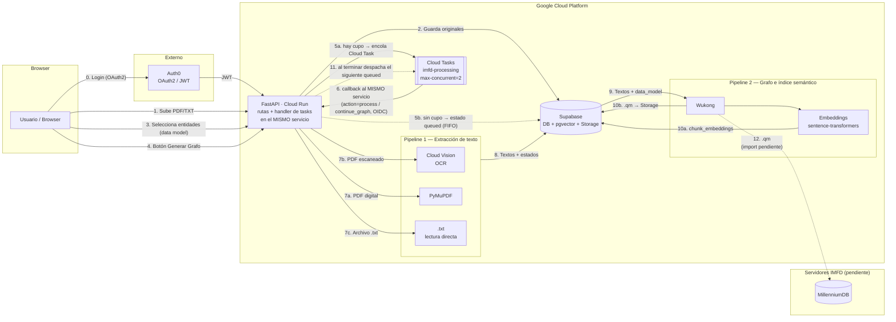
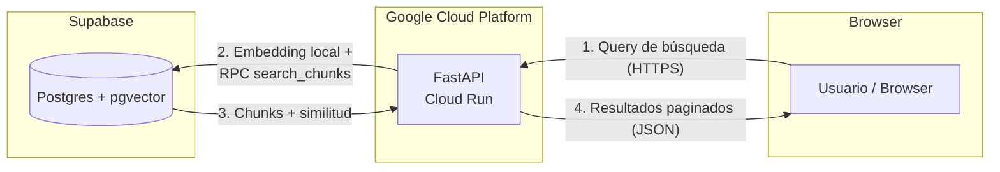

# Plataforma de Exploración Documental para Humanidades Digitales

> Proyecto de Título — Ingeniería Civil Industrial · Diploma en Tecnologías de Información
> Pontificia Universidad Católica de Chile · En colaboración con el **Instituto Milenio Fundamento de los Datos (IMFD)**

---

## Tabla de Contenidos

1. [Descripción General](#descripción-general)
2. [Funcionalidades Implementadas](#funcionalidades-implementadas)
3. [Cómo Funciona la Plataforma](#cómo-funciona-la-plataforma)
4. [Arquitectura del Sistema](#arquitectura-del-sistema)
5. [Stack Tecnológico](#stack-tecnológico)
6. [Estructura del Proyecto](#estructura-del-proyecto)
7. [Requisitos Previos](#requisitos-previos)
8. [Setup — Desarrollo Local](#setup--desarrollo-local)
9. [Variables de Entorno](#variables-de-entorno)
10. [CI/CD](#cicd)
11. [Rendimiento y escalamiento](#rendimiento-y-escalamiento)
12. [Testing](#testing)
13. [Integración con Wukong](#integración-con-wukong)
14. [Integración con MillenniumDB](#integración-con-millenniumdb)
15. [Docker](#docker)
16. [Equipo](#equipo)
17. [Sistema de diseño UI](#sistema-de-diseño-ui)

---

## Descripción General

Plataforma web tipo **buscador** (no un chat) que permite a investigadores del IMFD:

1. Subir colecciones de documentos (PDF/TXT) a un espacio personal
2. Definir qué entidades y relaciones quieren extraer (formulario en el frontend → `data_model.json`)
3. Procesar la colección con **Wukong** para construir un grafo de conocimiento (export `.qm`) y generar **embeddings de chunks** almacenados en **Supabase (pgvector)**
4. **Buscar** de forma **semántica** sobre fragmentos indexados y **visualizar el grafo** de conocimiento resultante con Cytoscape

---

## Funcionalidades Implementadas

### Autenticación y gestión de cuenta

| Funcionalidad | Descripción |
|---|---|
| **Login / Logout** | OAuth2 con Auth0; JWT validado en todas las rutas del backend |
| **Eliminar cuenta** | Borra archivos en Storage, datos en DB (cascada) y usuario en Auth0 (M2M) |

### Gestión de colecciones

| Funcionalidad | Descripción |
|---|---|
| **Crear colección** | Nombre, descripción e idioma; nombre único por usuario (409 si duplicado) |
| **Listar colecciones** | Con estado de procesamiento y progreso visible en la landing |
| **Renombrar colección** | `PATCH /api/collections/{id}` |
| **Eliminar colección** | Elimina colección y todos sus datos asociados |

### Carga de documentos

| Funcionalidad | Descripción |
|---|---|
| **Subida individual** | `POST /api/documentos/upload` — PDF/TXT hasta 30 MB, guardado en Supabase Storage |
| **Subida múltiple (batch)** | Resultado parcial con éxitos, duplicados y fallidos |
| **Deduplicación** | Detección por SHA-256; retorna 409 si el archivo ya existe en la colección |
| **URLs firmadas** | Acceso seguro a archivos en Storage |

### Pipeline de procesamiento

| Funcionalidad | Descripción |
|---|---|
| **Extracción de texto** | TXT directo, PDF digital (PyMuPDF), PDF escaneado (Google Cloud Vision OCR con DPI adaptativo e hints de idioma) |
| **Generación de grafo** | Wukong procesa textos + data model → exporta `.qm` |
| **Data model personalizado** | El frontend permite seleccionar entidades (Persona, Organización, Lugar, Evento); se envía a `POST .../generate-graph` |
| **Data model por idioma** | Modelos por defecto en español (`default_data_model_es.json`) e inglés (`default_data_model_en.json`) |
| **Cancelación cooperativa** | `POST .../process/cancel` — detiene el pipeline de forma segura |
| **Confirmación de grafo parcial** | Si la extracción tuvo errores parciales, el usuario puede confirmar continuar con `awaiting_graph_confirmation` |
| **Pipeline en segundo plano** | HTTP 202; `processing_queue` encola una Google Cloud Task que vuelve a llamar al mismo servicio (en local: thread daemon); el frontend hace polling sobre el estado de la colección |
| **Cola de procesamiento** | Cloud Tasks + límites de negocio: 2 jobs globales, 1 activo por usuario, hasta 5 en espera; recuperación de jobs huérfanos al arrancar |

**Estados de procesamiento:**
`idle` → `processing_text` → `processing_graph` → `graph_ready` / `partial_error` / `error` / `cancelled` / `awaiting_graph_confirmation`

> El estado `queued` es legacy y se normaliza a `idle` en la API.

### Búsqueda semántica

| Funcionalidad | Descripción |
|---|---|
| **Búsqueda vectorial** | `POST /api/search` — embedding de la consulta + RPC `search_chunks` con similitud coseno (pgvector / HNSW) |
| **Paginación** | 10 resultados por página con `offset` |
| **Filtros** | Por tipo de entidad, rango de años y score mínimo (backend completo; UI marcada como "próximamente") |
| **Facetas de entidades** | `GET /api/collections/{id}/entities` con caché en memoria |

### Visualización de grafo

| Funcionalidad | Descripción |
|---|---|
| **Visualizador Cytoscape** | `GET /api/collections/{id}/graph` — nodos y aristas renderizados con Cytoscape.js (layout `cose`) |
| **Panel de detalle** | Al seleccionar nodo o arista se muestra información del elemento |
| **Almacenamiento del grafo** | `.qm` subido a Supabase Storage tras el pipeline |

---

## Cómo Funciona la Plataforma

### Fase 1 — Carga de documentos

```
Investigador sube archivos (PDF y/o TXT) a una colección
        │
        ▼
Se guardan TAL CUAL en Supabase (Storage) y se registran en la base.
No corre el pipeline hasta usar "Generar Grafo".
```

### Fase 2 — Definición del data model

El investigador selecciona en el modal de carga qué entidades quiere extraer. Por ejemplo:

- **Entidades**: Persona, Organización, Lugar, Evento
- **Relaciones**: las define Wukong según el data model

Esto genera un `data_model.json` que Wukong usa para saber exactamente qué extraer. Si no se personaliza, el backend usa el modelo por defecto según el idioma de la colección.

### Fase 3 — Procesamiento (botón "Generar Grafo")

```
POST /api/collections/{id}/generate-graph   →   202 Accepted
        │   processing_queue evalúa capacidad:
        │     • hay cupo  → estado processing_text + encola una Cloud Task
        │     • sin cupo  → estado queued en Supabase (se despacha en orden FIFO)
        │
        │   La Cloud Task vuelve a llamar al MISMO servicio Cloud Run
        │   (action=process / continue_graph, autenticado con token OIDC)
        │   → processing_queue.execute_job → wukong_runner.process_collection
        │   (en local, sin Cloud Tasks configurado, corre en un thread daemon)
        ▼
═══════════════════════════════════════════════════════
  PIPELINE 1 — Extracción de texto (por documento)
═══════════════════════════════════════════════════════

  El backend descarga los archivos originales de Supabase
        │
        ▼
  Para cada archivo:
  ├── Es .txt?          → lectura directa del texto
  ├── PDF digital?      → PyMuPDF extrae el texto
  └── PDF escaneado?    → Google Cloud Vision (OCR por página renderizada,
                          DPI adaptativo, hints de idioma según colección)
        │
        ▼
  El texto extraído se guarda en Supabase (tabla document_texts)

        │   [Si hay errores parciales → awaiting_graph_confirmation]
        ▼
═══════════════════════════════════════════════════════
  PIPELINE 2 — Wukong procesa el workdir
═══════════════════════════════════════════════════════

  Estructura workdir:
    .../docs/text/preview/
    │     ├── <id-doc>.txt
    │     └── ...
    └── data_model.json

  Wukong:
    1. Divide cada .txt en chunks
    2. Usa OpenAI para extraer entidades y relaciones
    3. Emite artefactos bajo exports/ (incl. .qm y JSONs)

        │
        ▼
═══════════════════════════════════════════════════════
  PIPELINE 3 — Índice semántico en Supabase (pgvector)
═══════════════════════════════════════════════════════

  Con los chunks de Wukong, el backend genera embeddings locales
  (sentence-transformers) e inserta en chunk_embeddings
  (índice HNSW + RPC search_chunks).

  El .qm se sube a Supabase Storage para visualización del grafo.

        │
        ▼
═══════════════════════════════════════════════════════
  MillenniumDB (integración pendiente)
═══════════════════════════════════════════════════════

  El .qm puede importarse en el servidor IMFD (mdb import …).
  El código de import está preparado en millenniumdb.py;
  la integración automática al pipeline es trabajo pendiente.
```

> **Resumen**:
> - Originales y textos extraídos → **Supabase Storage + DB**
> - Chunks + embeddings para búsqueda → **Supabase (`chunk_embeddings`)**
> - Grafo visualizable (`.qm`) → **Supabase Storage** (descargado por el frontend vía API)
> - Grafo en **MillenniumDB** → integración pendiente

### Fase 4 — Búsqueda y visualización

```
Investigador escribe en el buscador de la colección
        │
        ▼
POST /api/search  { coleccion_id, query, filtros opcionales, … }
        │
        ▼
FastAPI genera el embedding de la consulta (mismo modelo que en indexación)
        │
        ▼
Supabase: RPC search_chunks (similitud coseno; filtros por tipo / años si aplica)
        │
        ▼
FastAPI devuelve fragmentos paginados con score y storage_path
        │
        ▼
Frontend muestra lista de resultados — toggle al visualizador de grafo Cytoscape
```

---

## Arquitectura del Sistema

### Diagrama A — Flujo de carga y procesamiento



### Diagrama B — Flujo de consulta / búsqueda



### Protocolos de comunicación

| Conexión | Protocolo | Detalle |
|---|---|---|
| Browser ↔ FastAPI | **HTTPS** (producción) / **HTTP** (local) | REST; CORS permite el origen del dev server de Vite |
| Browser → Auth0 | **HTTPS (OAuth2)** | Login; el front obtiene JWT para la API |
| FastAPI → Auth0 | **HTTPS (JWKS)** | Validación de JWT (middleware) + eliminación de usuarios (M2M) |
| FastAPI → Supabase | **HTTPS (REST)** | Cliente PostgREST / Storage / RPC (`search_chunks`, etc.) |
| FastAPI → Google Cloud Vision | **API cliente oficial** | Credenciales vía `GOOGLE_APPLICATION_CREDENTIALS` |
| FastAPI → MillenniumDB | **WebSocket** | Driver `millenniumdb_driver` (`ws://host:puerto`); no usado en el flujo principal actual |
| FastAPI → OpenAI | **HTTPS** | Consumido por **Wukong** (extracción de entidades/relaciones) |
| Embeddings | **Proceso local** | `sentence-transformers` (sin API key; descarga modelo a caché HuggingFace) |
| FastAPI ↔ Wukong | **Subproceso Python** | `python -m wukong_engine` en el mismo contenedor / máquina |
| FastAPI → Cloud Tasks | **API cliente oficial** | `enqueue_processing_task` crea un HTTP task con `oidc_token` (action=process / continue_graph) |
| Cloud Tasks → FastAPI | **HTTPS + OIDC** | La task vuelve a llamar al **mismo** servicio Cloud Run; `verify_cloud_tasks_caller` valida el ID token (audience = URL del handler) |
| Pipeline async | **Cloud Tasks** (prod) / **thread daemon** (local) | `processing_queue` encola en GCP cuando `CLOUD_TASKS_*` está configurado; si no, hace fallback a un hilo local |

---

## Stack Tecnológico

| Capa | Tecnología | Versión |
|---|---|---|
| Frontend | React + TypeScript + Vite | React 19, Vite 8, Node 20 |
| Visualización de grafo | Cytoscape.js + react-cytoscapejs | cytoscape 3.33 |
| Backend / API | FastAPI (Python) | Python 3.13, FastAPI 0.115 |
| Autenticación | Auth0 (JWT / OAuth2) | Servicio externo |
| Base de datos + Storage + vectores | Supabase (Postgres, Storage, **pgvector** HNSW) | — |
| Extracción de texto | PyMuPDF + **Google Cloud Vision** (OCR escaneados) | `google-cloud-vision` 3.10 |
| Grafo de conocimiento | Wukong (IMFD) → export `.qm` | submodule Python 3.13 |
| Búsqueda semántica | **sentence-transformers** + Supabase `search_chunks` | `paraphrase-multilingual-MiniLM-L12-v2` |
| Grafo en IMFD | MillenniumDB + driver WebSocket | integración pendiente |
| Orquestación async | **Google Cloud Tasks** (callback al mismo servicio Cloud Run; HTTP 202); fallback a thread daemon en local | cola `imfd-processing` |
| Deploy producción | Google Cloud Run + Artifact Registry | us-central1 |
| CI/CD | GitHub Actions | ci.yml (lint+test) + cd.yml (deploy) |
| Tests backend | pytest 8.3 | 16 módulos |
| Tests frontend | Jest 30 + Testing Library | cobertura amplia |

> **Nota sobre Python**: Wukong requiere Python 3.13+. El backend usa la misma versión para compatibilidad.

---

## Estructura del Proyecto

```
TallerDeIntegracion_G10/
├── .github/
│   └── workflows/
│       ├── ci.yml              # CI: lint + test en cada push/PR a main
│       └── cd.yml              # CD: build Docker + deploy a Cloud Run
├── backend/
│   ├── app/
│   │   ├── main.py             # FastAPI: CORS, routers, static SPA
│   │   ├── config.py           # Pydantic Settings (todas las env vars)
│   │   ├── api/routes/
│   │   │   ├── health.py            # GET /health, GET /ready
│   │   │   ├── collections.py       # CRUD + pipeline + grafo + entidades
│   │   │   ├── documentos.py        # Carga individual, batch, URLs firmadas
│   │   │   ├── usuarios.py          # DELETE /usuarios/me
│   │   │   ├── search.py            # POST /api/search
│   │   │   └── internal_tasks.py    # Handler que ejecuta el job (callback de Cloud Tasks)
│   │   ├── middleware/
│   │   │   ├── auth.py              # JWT Auth0
│   │   │   └── cloud_tasks_auth.py # Verifica OIDC de Cloud Tasks
│   │   ├── models/                  # Pydantic (document, search)
│   │   ├── schemas/                 # graph.py (DataModelUpdate)
│   │   └── services/
│   │       ├── supabase_client.py   # DB, Storage, chunk_embeddings, RPC
│   │       ├── text_extraction.py   # TXT / PyMuPDF / Cloud Vision
│   │       ├── wukong_runner.py     # Orquestación: extracción → Wukong → embeddings
│   │       ├── embeddings_service.py
│   │       ├── graph_transformer.py # .qm → Cytoscape; facetas de entidades
│   │       ├── qm_storage.py        # Upload/download .qm en Storage
│   │       ├── processing_queue.py  # Despacho/encolado, capacidad y recuperación
│   │       ├── cloud_tasks_client.py # Encola HTTP tasks en Google Cloud Tasks
│   │       ├── delete_user.py       # Eliminación completa de cuenta
│   │       ├── millenniumdb.py      # Cliente WebSocket + import .qm (preparado, no integrado)
│   │       ├── vision_quota.py      # Control de cuota OCR
│   │       ├── default_data_model_es.json
│   │       └── default_data_model_en.json
│   ├── supabase/migrations/         # 15 migraciones SQL (esquema + pgvector)
│   ├── wukong-engine/               # Submodule Wukong
│   ├── tests/                       # 16 módulos pytest
│   ├── scripts/                     # Utilidades (grafo, OCR, cuotas)
│   ├── docs/                        # PROCESAMIENTO_BACKGROUND_Y_CANCELACION.md
│   ├── static/                      # Frontend compilado (servido por FastAPI)
│   ├── lib/                         # vis-network, tom-select (assets grafo)
│   ├── requirements.txt
│   ├── Dockerfile
│   └── .env.example
├── frontend/
│   ├── src/
│   │   ├── App.tsx
│   │   ├── App.css
│   │   ├── index.css
│   │   ├── styles/
│   │   │   ├── design-tokens.css   # Tokens IMFD (colores, layout, botones)
│   │   │   └── theme-overrides.css # Modo oscuro unificado (html.bc-dark)
│   │   ├── pages/
│   │   │   ├── landing_page/            # Dashboard de colecciones
│   │   │   ├── login_page/
│   │   │   ├── buscador_coleccion/      # Buscador semántico + toggle grafo
│   │   │   ├── visualizador_grafo/      # Cytoscape.js
│   │   │   └── navbar/
│   │   ├── components/                  # Modales (carga, documentos, eliminar, renombrar)
│   │   │   ├── ui/                      # AppLoading y utilidades visuales
│   │   │   └── ThemeSync.tsx            # Sincroniza html.bc-dark con prefers-color-scheme
│   │   ├── lib/
│   │   │   └── collection_processing.ts # Lógica estados, banners, progreso
│   │   └── assets/
│   ├── public/
│   ├── index.html
│   ├── package.json
│   └── .env.example
├── infra/
│   ├── cloud_tasks/
│   │   └── setup.sh         # Crea la cola Cloud Tasks + SA invoker + permisos IAM
│   └── millenniumdb/
│       ├── entrypoint.sh    # Script para levantar mdb server local
│       └── sample.ttl       # Datos de ejemplo TTL
├── Dockerfile               # Multi-stage: frontend build + backend Python 3.13
├── docker-compose.yml       # Dev: backend :8080 con hot reload
└── README.md
```

### Endpoints principales

| Método | Ruta | Descripción |
|---|---|---|
| GET | `/health` | Estado del servidor |
| GET | `/api/collections` | Lista colecciones del usuario |
| POST | `/api/collections` | Crear colección |
| GET | `/api/collections/{id}` | Detalle + status de procesamiento |
| PATCH | `/api/collections/{id}` | Renombrar |
| DELETE | `/api/collections/{id}` | Eliminar |
| POST | `/api/collections/{id}/generate-graph` | Iniciar pipeline con data model personalizado (202) |
| POST | `/api/collections/{id}/generate-graph/continue-graph` | Continuar tras confirmación parcial |
| POST | `/api/collections/{id}/process` | Iniciar pipeline con data model por defecto (202) |
| POST | `/api/collections/{id}/process/cancel` | Cancelar pipeline |
| POST | `/api/collections/{id}/process/continue-graph` | Continuar pipeline (default model) |
| GET | `/api/collections/{id}/graph` | Grafo en formato Cytoscape.js |
| GET | `/api/collections/{id}/entities` | Facetas de entidades para filtros |
| POST | `/api/documentos/upload` | Subir documento |
| POST | `/api/documentos/upload/batch` | Subida múltiple |
| GET | `/api/documentos` | Listar documentos |
| POST | `/api/search` | Búsqueda semántica |
| DELETE | `/usuarios/me` | Eliminar cuenta completa |

---

## Requisitos Previos

| Herramienta | Versión mínima | Para qué |
|---|---|---|
| **Python** | 3.13+ | Backend + Wukong |
| **Node.js** | 20+ | Frontend |
| **npm** | 10+ | Frontend |
| **Git** | 2.x | Submódulo `wukong-engine` |
| **Docker** | 24+ | (Opcional) Desarrollo con contenedores |
| **Cuenta / clave GCP** | — | Solo si pruebas el OCR con Cloud Vision |

---

## Setup — Desarrollo Local

### 1. Clonar el repositorio

```bash
git clone --recurse-submodules https://github.com/renaa-m/TallerDeIntegracion_G10.git
cd TallerDeIntegracion_G10
```

Si ya clonaste sin submodules:

```bash
git submodule update --init --recursive
```

### 2. Backend

```bash
cd backend

python3.13 -m venv venv
source venv/bin/activate        # Windows: venv\Scripts\activate

pip install -r requirements.txt
pip install -e ./wukong-engine

cp .env.example .env
# Completar .env (ver Variables de Entorno)

uvicorn app.main:app --reload --port 8080
```

El backend queda en:
- API: `http://localhost:8080`
- Swagger: `http://localhost:8080/docs`
- ReDoc: `http://localhost:8080/redoc`

### 3. Supabase

El proyecto Supabase **es compartido del equipo**.

- Pedir credenciales por un canal seguro (`SUPABASE_URL`, `SUPABASE_KEY`, `SUPABASE_SERVICE_KEY`).
- Las **migraciones** en `backend/supabase/migrations/` son la referencia del esquema; en el proyecto compartido ya están aplicadas.

### 4. Frontend

```bash
cd frontend
npm install
```

Crear `frontend/.env`:

```env
VITE_API_URL=http://localhost:8080
VITE_AUTH0_DOMAIN=...
VITE_AUTH0_CLIENT_ID=...
VITE_AUTH0_AUDIENCE=...
```

```bash
npm run dev
```

Queda en `http://localhost:5173`.

### 5. Verificar que todo funciona

```bash
# Backend
cd backend && source venv/bin/activate
pytest tests/ -v
ruff check app/ tests/

# Frontend
cd ../frontend
npm run lint
npm run format:check
npm test
npm run build
```

---

## Variables de Entorno

```bash
cd backend
cp .env.example .env
```

```env
# OpenAI — Wukong (extracción con LLM). Sin comillas.
OPENAI_API_KEY=

# Supabase
SUPABASE_URL=https://your-project.supabase.co
SUPABASE_KEY=your-anon-or-service-key
SUPABASE_SERVICE_KEY=your-service-role-key

# Auth0
AUTH0_DOMAIN=your-tenant.auth0.com
AUTH0_API_AUDIENCE=https://your-api-identifier
AUTH0_M2M_CLIENT_ID=...
AUTH0_M2M_CLIENT_SECRET=...

# MillenniumDB (driver WebSocket)
MILLENNIUMDB_HOST=localhost
MILLENNIUMDB_PORT=1234

# Google Cloud Vision (PDF escaneados)
GOOGLE_APPLICATION_CREDENTIALS=gcp-vision-key.json

# Opcional: copia del workdir Wukong tras cada run (depuración)
WUKONG_ARTIFACTS_DIR=

# Cloud Tasks (orquestación async en GCP).
# Si quedan vacías, el pipeline corre en un thread daemon local (dev).
# Deben estar TODAS presentes para que processing_queue encole en Cloud Tasks.
GCP_PROJECT_ID=your-gcp-project-id
CLOUD_TASKS_QUEUE=imfd-processing
CLOUD_TASKS_LOCATION=us-central1
CLOUD_TASKS_SERVICE_URL=https://your-service.run.app
CLOUD_TASKS_INVOKER_SA=imfd-tasks-invoker@your-gcp-project-id.iam.gserviceaccount.com

# HU-13: reintentos de subida a Storage
MAX_UPLOAD_RETRIES=3
UPLOAD_RETRY_DELAY_SECONDS=1.0

# OCR: DPI para páginas simples y complejas
OCR_DPI_DEFAULT=300
OCR_DPI_COMPLEX=400

DEBUG=true
```

> `OPENAI_API_KEY` sin comillas. El `.env` no se sube al repo.

---

## CI/CD

### CI — `.github/workflows/ci.yml`

Corre en **push** y **pull request** a `main`:

| Job | Pasos |
|---|---|
| **Backend** | Python 3.13, `pip install`, `ruff check`, `pytest` (con secrets de Supabase, Auth0, OpenAI) |
| **Frontend** | Node 20, `npm install`, `eslint`, `prettier --check`, `jest --coverage`, `npm run build` |

### CD — `.github/workflows/cd.yml`

Corre en **push a `main`**:

1. Checkout con submodules (PAT para wukong-engine privado)
2. Auth GCP + escribe credenciales Vision
3. Descarga y cachea modelo HuggingFace (`paraphrase-multilingual-MiniLM-L12-v2`)
4. `docker build` imagen multi-stage
5. Push a Artifact Registry: `us-central1-docker.pkg.dev/titulo-grupo10/imfd-backend/imfd-app`
6. Deploy Cloud Run (`imfd-backend`) con los flags de la sección siguiente.

> La cola de Cloud Tasks y la service account `imfd-tasks-invoker` se crean una vez con `infra/cloud_tasks/setup.sh` (fuera del CD).

---

## Rendimiento y escalamiento

### Cloud Run — flags de deploy

El servicio se despliega con estos flags (ver `cd.yml`), todos justificados por el perfil del pipeline:

| Flag | Valor | Por qué |
|---|---|---|
| `--memory` | **6Gi** | Dimensionado para lotes de ~30 docs. Con 10 docs el pico fue ~1.95 GB (base ~1 GB + ~1 GB del subproceso Wukong); 30 docs ≈ ~4 GB, 6Gi deja colchón anti-OOM. Lotes ~90 requerirán remedir y quizá `--cpu=4` (cpu=2 topa en 8Gi). |
| `--cpu` | **2** | La CPU queda casi ociosa (~0.5% p50); no se sube. |
| `--no-cpu-throttling` | — | La CPU no se limita entre requests; necesario porque el job sigue activo tras devolver el 202. |
| `--concurrency` | **1** | La instancia que arma un grafo (Cloud Task) no comparte con peticiones de usuarios; éstas caen en otra instancia y la página sigue respondiendo. |
| `--min-instances` | **1** | Evita cold starts (la imagen carga el modelo de embeddings). |
| `--max-instances` | **5** | Tope de escalado horizontal. |
| `--timeout` | **3600** | Un grafo largo no debe cortarse en los 300s por defecto. |

### Cola de procesamiento (Cloud Tasks + límites de negocio)

`processing_queue` aplica el control de capacidad **antes** de encolar; Cloud Tasks aplica el suyo a nivel de cola:

| Límite | Valor | Dónde |
|---|---|---|
| Jobs concurrentes globales | `MAX_CONCURRENT_JOBS = 2` | `processing_queue.py` + `--max-concurrent-dispatches=2` en la cola |
| Jobs activos por usuario | **1** | `processing_queue` (vía `get_user_blocking_collection`) |
| Colecciones en espera por usuario | `MAX_QUEUED_PER_USER = 5` | `processing_queue.py` |
| Reintentos por task | **3** (`--max-attempts`), backoff 30s→600s | cola Cloud Tasks |
| Despacho | **1/s** (`--max-dispatches-per-second`) | cola Cloud Tasks |

**Flujo de capacidad:** si hay cupo → `processing_text` + Cloud Task; si no → estado `queued` en Supabase. Al terminar un job, `_try_dispatch_queued_from_db()` despacha el siguiente candidato FIFO respetando el límite por usuario. En el arranque del servicio, `recover_orphaned_processing()` re-encola jobs huérfanos (`processing_*`) y despacha los `queued` pendientes.

---

## Testing

### Backend

```bash
cd backend
source venv/bin/activate
pytest tests/ -v --tb=short
```

Módulos de test (cobertura ~70%):

| Módulo | Qué prueba |
|---|---|
| `test_health.py` | `/health`, `/ready` |
| `test_auth.py` | Middleware JWT Auth0 |
| `test_collections.py` | CRUD colecciones, estados, pipeline |
| `test_documentos.py` | Upload individual y batch, deduplicación |
| `test_text_extraction.py` | TXT, PyMuPDF, Vision OCR |
| `test_wukong_runner.py` | Orquestación del runner |
| `test_search.py` | Búsqueda semántica |
| `test_search_not_ready.py` | Colección no lista → `ready: false` |
| `test_delete_user.py` | Eliminación de cuenta |
| `test_collection_entities.py` | Facetas de entidades |
| `test_processing_queue.py` | Cola de procesamiento |
| `test_graph_transformer.py` | Parseo .qm → Cytoscape |
| `test_qm_storage.py` | Upload/download Storage |
| `test_vision_quota.py` | Control cuota OCR |
| `test_usuarios.py` | Rutas de usuario |

### Frontend

```bash
cd frontend
npm test                  # Jest + Testing Library
npm run lint              # ESLint
npm run format:check      # Prettier
```

---

## Integración con Wukong

[Wukong](https://github.com/MillenniumDB/wukong-engine) construye el grafo a partir de textos + `data_model.json`. Está en **`backend/wukong-engine/`** (submódulo).

```bash
git submodule update --init --recursive
cd backend
pip install -e ./wukong-engine
```

### Qué necesita Wukong

1. **`OPENAI_API_KEY`**
2. **Workdir** con `docs/text/preview/*.txt` y `data_model.json`
3. **Config** TOML: `wukong-engine/config/default.toml`

### Ejecución manual

```bash
python -m wukong_engine <path/to/data_dir> --config backend/wukong-engine/config/default.toml
```

### Salida

En `<data_dir>/exports/`: el **`.qm`** y JSONs de entidades y relaciones. El backend además genera filas en **`chunk_embeddings`** y sube el `.qm` a Supabase Storage.

---

## Integración con MillenniumDB

[MillenniumDB](https://github.com/MillenniumDB/MillenniumDB) corre en servidores del IMFD. Las consultas desde el driver Python usan **WebSocket** (`ws://host:puerto`).

### CLI (operación en el servidor IMFD)

```bash
mdb import knowledge_graph.qm /path/to/mi-db
mdb server /path/to/mi-db --port 1234 --timeout 3600
```

### Ejemplo de driver en Python

```python
import millenniumdb_driver

driver = millenniumdb_driver.driver("ws://localhost:1234")
session = driver.session()
result = session.run(
    "MATCH (?person :Persona)-[:VotaEn]->(?sent :Sentencia) RETURN *"
)
data = result.data()
driver.close()
```

El cliente está en `backend/app/services/millenniumdb.py` (también con el código de import `.qm` preparado). La **import automática del `.qm` al pipeline** es trabajo pendiente.

---

## Docker

### Desarrollo local

```bash
docker compose up --build
```

Levanta el backend en `:8080` con hot reload. Para incluir el frontend compilado, correr `npm run build` en `frontend/` primero.

### Imagen de producción (raíz)

```bash
docker build -t imfd-explorer:latest .
docker run -p 8080:8080 --env-file backend/.env imfd-explorer:latest
```

---

## Equipo

Proyecto de Título 2025 — Pontificia Universidad Católica de Chile
En colaboración con el Instituto Milenio Fundamento de los Datos (IMFD)

---

## Sistema de diseño UI

La interfaz de **NotebookIMFD** sigue una paleta y reglas compartidas definidas en `frontend/src/styles/design-tokens.css`. Ese archivo es la **fuente de verdad** para colores, espaciado de layout y componentes base. Se importa una sola vez desde `main.tsx`, antes de `index.css`. El modo oscuro se aplica con la clase `html.bc-dark` (sincronizada por `ThemeSync` y reforzada en `theme-overrides.css`).

### Identidad visual (marca IMFD)

| Token | Valor (referencia) | Uso |
|---|---|---|
| `--imfd-navy` | `#243166` | Fondos oscuros, identidad institucional |
| `--imfd-yellow` / `--imfd-yellow-bright` | `#f8ffa1` / `#fbffa1` | Acentos de carga, highlights |
| `--imfd-pink` | `#f6d5ee` | Gradientes, estados suaves |
| `--imfd-accent` | `#aba3f6` | Botones primarios, bordes, foco |
| `--danger` | `#ef4444` | Eliminar, alertas destructivas |

**Modo claro:** gradiente vertical amarillo → rosa → blanco (`--bg-gradient`).

**Modo oscuro:** gradiente radial azul (`--imfd-navy` → `#1a1a2e`), activado con `prefers-color-scheme: dark` → clase `html.bc-dark`.

> Regla: no hardcodear `#7c3aed`, `#aa3bff` ni amarillos fuera de paleta en pantallas nuevas. Usar siempre variables CSS del design system.

### Layout global

| Regla | Valor | Dónde aplica |
|---|---|---|
| Altura navbar | `--navbar-height: 72px` | `navbar.css`, spacer en `App.tsx`, `buscador_coleccion.css` |
| Scroll principal | `overflow: auto` en `<main>` | Permite listar muchas colecciones en landing |
| Contenido interno full-height | `overflow: hidden` en `.bc-root` | Buscador y vistas que ocupan todo el viewport útil |

### Tipografía

| Rol | Familia | Tamaños de referencia |
|---|---|---|
| UI general | `DM Sans` (`--font-sans`) | 14–18px cuerpo |
| Títulos de modales | `DM Serif Display` (`--font-display`) | 20–22px |
| Hero landing | `DM Sans` bold | 52px → 40px → 32px (responsive) |
| Título de sección | `DM Sans` bold | 32px landing / 28px tablet |
| Título de card | `DM Sans` bold | 20px (no igualar al título de sección) |

### Componentes compartidos

| Clase / componente | Archivo | Cuándo usarlo |
|---|---|---|
| `.imfd-btn-primary` | `design-tokens.css` | CTA principal (login, landing, acciones afirmativas) |
| `<AppLoading />` | `components/ui/app_loading.tsx` | Auth, callback, carga de listas (prop `compact` en bloques internos) |
| `ModalRenombrarColeccion` | `components/modal_renombrar_coleccion/` | Renombrar colección (sustituye `window.prompt`) |
| `ModalEliminarColeccion` | `components/modal_eliminar_coleccion/` | Confirmación destructiva (sustituye `window.confirm`) |

### Reglas de interacción

1. **No usar diálogos nativos** (`prompt`, `confirm`, `alert`) en flujos de producto; usar modales del design system.
2. **Copy contextual en landing:** si el usuario no tiene colecciones → botón **Iniciar**; si ya tiene → **Nueva colección** y subtítulo orientado a retomar trabajo.
3. **Badge de bienvenida:** texto inclusivo **Bienvenido/a** (no asumir género).
4. **Cards de colección:** botón interno `Abrir colección …` separado de acciones editar/eliminar (evita botones anidados inaccesibles).
5. **Estados de foco:** botones primarios e iconos deben tener `:focus-visible` con `--accent`.

### Radios y sombras

| Token | Valor | Uso típico |
|---|---|---|
| `--radius-sm` | `12px` | Inputs, chips |
| `--radius-md` | `16px` | Botón primario |
| `--radius-lg` | `24px` | Cards, modales |
| `--radius-pill` | `999px` | Badges, icon buttons |
| `--shadow-accent` | sombra lila | CTA primario |
| `--shadow-card` | sombra suave | Hover de cards |

### Grid del landing (colecciones)

| Breakpoint | Columnas |
|---|---|
| `> 1024px` | 3 |
| `641px – 1024px` | 2 |
| `≤ 640px` | 1 |

### Flujo `/colecciones/nueva/buscador` (buscador — creación)

Esta ruta combina el **ModalCarga** (paso 1) con el layout del buscador detrás.

| Situación | Comportamiento UI |
|---|---|
| Sidebar — título | Mostrar **Nueva colección**, nunca "Cargando…" |
| Sidebar — etiqueta | **Creación en curso** (no "Colección actual") |
| Renombrar inline | **Oculto** en `nueva` (solo renombrar en modal de carga o tras crear UUID) |
| Borrar colección | **Oculto** en `nueva` (no hay recurso persistido aún) |
| Ver documentos | Botón **deshabilitado** hasta que exista colección |
| Barra de búsqueda | **Deshabilitada** en `nueva`; placeholder explicativo |
| Botón **Buscar** | Visible junto al input; deshabilitado en `nueva` |
| Empty state (modal cerrado) | Onboarding: **Empieza subiendo documentos** + CTA **Añadir fuentes** |
| Loader de búsqueda | Copy: **Buscando en tus documentos…** (no "grafo de conocimiento") |

**Estilo sidebar:** botones `.bc-add-btn` alineados a tokens IMFD (lila suave, sin sombra neo-brutalista amarilla). Filtros usan accent `#aba3f6`.

**Capitalización:** preferir oración en botones — p. ej. "Criterios de búsqueda", "Ver documentos", "Ver grafo".

### Modal `ModalCarga` (`components/modal_carga/`)

Ventana de **subida de archivos** y **procesamiento del grafo** (`Procesar grafo`). La monta `buscador_coleccion.tsx` cuando `modalCargaOpen === true`.

| Etapa | Título modal | Contenido |
|---|---|---|
| `subida` | Añadir fuentes | Dropzone, lista de archivos, nombre de colección, idioma |
| `pipeline` | Procesar grafo | Pasos Extracción → Construcción → Listo, barras de progreso, entidades |

**Reglas UI:**

- Tokens del panel: `--mc-*` derivados de `design-tokens.css` (claro y `html.bc-dark`).
- **Entidades a extraer:** fondo `--mc-surface-2`, texto `--mc-text-1` legible; estado seleccionado con borde `--mc-accent`. No usar cajas navy fijas en modo claro.
- **Pasos del pipeline:** clase `pending` en pasos inactivos; bordes/fondos con `--mc-border` / `--mc-surface-2`.
- **CTA principal** (`.mc-btn-upload`): accent IMFD `#aba3f6`, sin sombra neo-brutalista navy.
- **Barra de progreso:** fill `--mc-accent`, no azul `#2563eb`.
- Texto de ayuda de entidades: `--mc-text-2` (contraste mínimo AA sobre el panel).

### Modo oscuro — checklist para pantallas nuevas

Al crear o refactorizar una vista, verificar que **no queden colores fijos** en:

- Fondos de cards y popups (`var(--surface)`, `var(--card-bg)`)
- Texto secundario (`var(--text-2)`, `var(--text-3)`)
- Bordes (`var(--border)`)
- Botones icono (`var(--icon-btn-bg)`)

El navbar, login, landing, buscador (`/nueva` y existentes), modales de eliminar/renombrar y el popup de errores del landing ya consumen tokens y respetan `prefers-color-scheme` vía `html.bc-dark`.

### Archivos clave del design system

- `frontend/src/styles/design-tokens.css` — tokens y `.imfd-btn-primary`
- `frontend/src/styles/theme-overrides.css` — overrides de modo oscuro
- `frontend/src/components/ThemeSync.tsx` — sincroniza `html.bc-dark`
- `frontend/src/pages/landing_page/*` — layout, dark mode, modales, copy dinámico
- `frontend/src/pages/buscador_coleccion/*` — flujo `nueva`, searchbar, empty onboarding, tokens
- `frontend/src/components/modal_carga/*` — pipeline, entidades, progreso, tokens IMFD
- `frontend/src/components/modal_filtro/modal_filtros.module.css` — accent `#aba3f6`
- `frontend/src/pages/navbar/navbar.css` — accent alineado a `#aba3f6`
- `frontend/src/pages/login_page/*` — botón compartido, sin `:root` duplicado
- `frontend/src/App.tsx` — spacer 72px, scroll en main, loading unificado
- `frontend/src/components/ui/app_loading.*` — spinner de carga compartido

### Cómo extender el sistema

1. Añadir tokens nuevos solo en `design-tokens.css` (con variante dark si aplica).
2. Prefijar estilos de página con clase raíz (ej. `.landing-page`) para no pisar globals.
3. Reutilizar modales existentes antes de crear uno nuevo.
4. Documentar aquí cualquier regla nueva acordada por el equipo.
